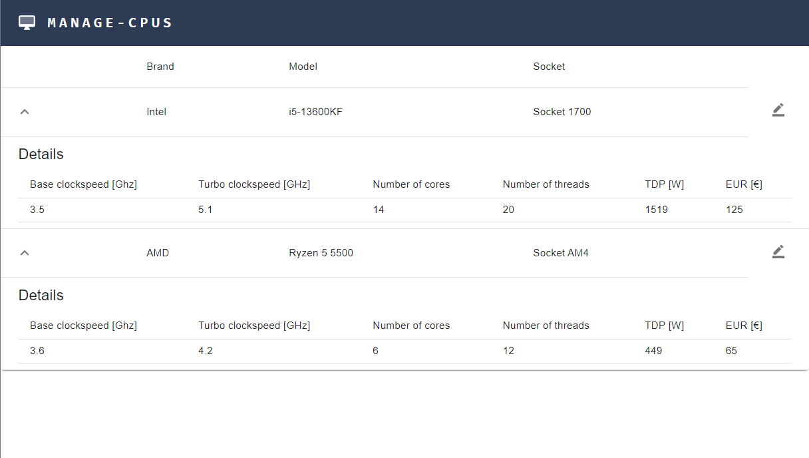
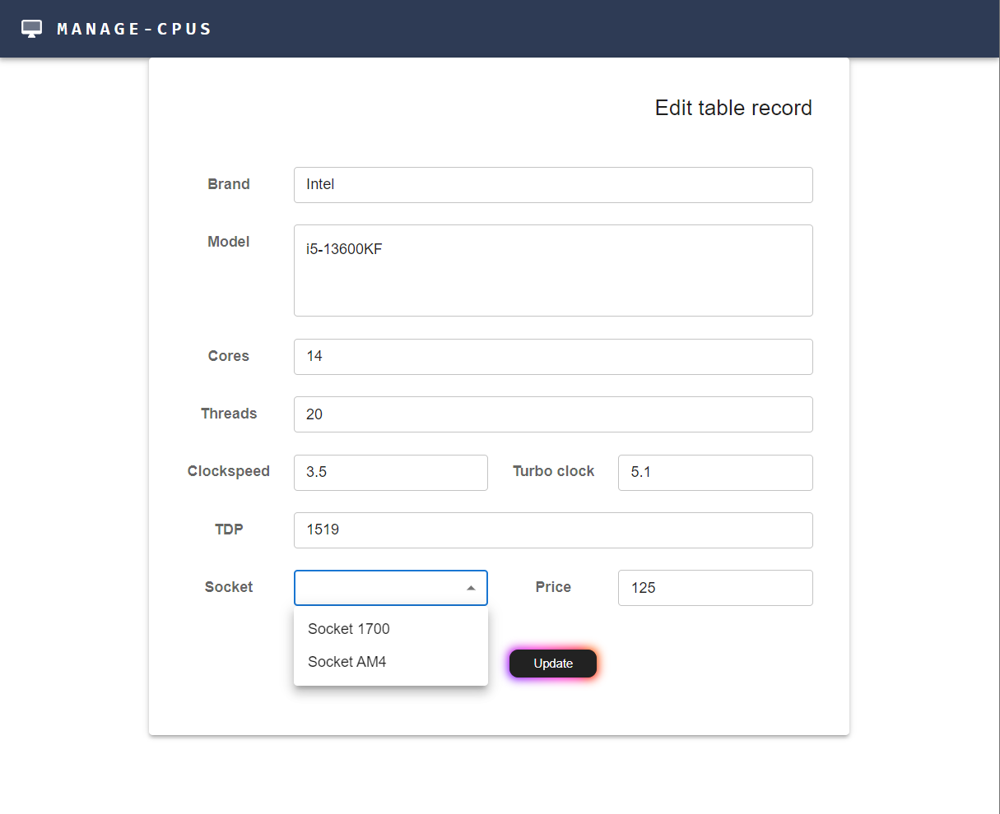

# Intern task
The simple web application that will display a list of CPUs and much, much more in the future.

## Introduce
Data on each CPU can be changed according to the data limitations of the fields.\
Technology stack:
- Backend 
  - Spring Boot (v3.0.5)
  - Hibernate (v6.1.7)
  - Java (v17.0.6)
- Frontend
  - React.js(v18.2.0)
  - npm (v9.5.0) 

## Getting started
To get started with the application, you'll need to have Java SDK (recommended version 17.0.6), npm (recommended version 9.5.0), and React.js installed on your system. If you don't have them already, you can download and install them from the official websites.

**Java SE 17 (Oracle Official Site)**:
[happy_link](https://www.oracle.com/java/technologies/javase/jdk17-archive-downloads.html)\
**Node.js & npm (Oracle Official Site)**: [happy_link](https://nodejs.org/en)\
**React.js**: Install via command: ```npx create-react-app my-app```

## Quick config
1. First of all, clone this repository
1. Modify configuration file:
...\backend\cpudemo\src\main\resources\\**application.properties**
```java
# database
spring.datasource.url=jdbc:mysql:<your_host_and_port>/cpu-schema
spring.datasource.username=<your_username>
spring.datasource.password=<your_password>
spring.datasource.driver-class-name=com.mysql.cj.jdbc.Driver

# hibernate
spring.jpa.hibernate.ddl-auto=update
spring.jpa.properties.hibernate.dialect=org.hibernate.dialect.MySQLDialect
```
3. Run initialized data service and Spring Boot application
4. Go to ...\frontend_react\**cpu-front** dir, open terminal and pass command: ```npm start```

## How to use it?
The application is now running, and you can access it through any browser by typing the URL http://localhost3000. In addition, you can use any API platform to check data by requests.

## Demo



## Contributing
Pull requests are welcome. For major changes, please open an issue first
to discuss what you would like to change.

Please make sure to update tests as appropriate.
